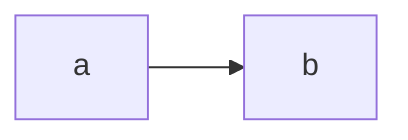

Create a markdown document with at least one mermaid block. Example:



- Install the [Pandoc Diagram Extension](https://github.com/pandoc-ext/diagram)
  - For example, you can `git clone` into `~/.local/share`.
- Install the [Mermaid CLI](https://github.com/mermaid-js/mermaid-cli)
- Create a `diagram-filter.yaml` like:

```yaml
filters: ["$HOME/.local/share/diagram/diagram.lua"]
metadata:
  engine:
    mermaid: true
```

Set the mermaid bin if necessary:

```sh
export MERMAID_BIN="$(which mmdc)"
```

Run the conversion:

```sh
pandoc -d diagram-filter.yaml -o output.docx input.md
```

Open the file:

```sh
open output.docx
```

